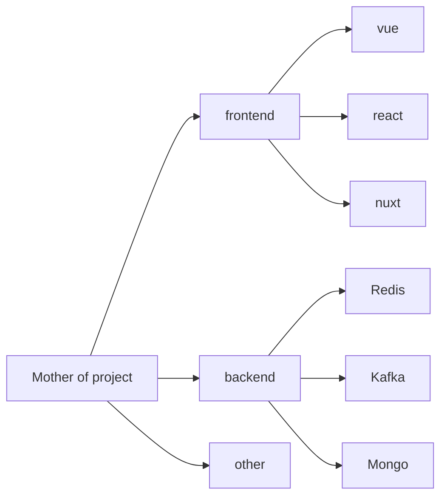

# Techstack

```mermaid
graph LR;
  a[Mother of project]

  a --> f[frontend]
  a --> b[backend]
  a --> c[other]

  b --> r[Redis]
  b --> k[Kafka]
  b --> m[Mongo]

  f --> v[vue]
  f --> rr[react]
  f --> n[nuxt]

```
